# Pampanaa — Lane Defense Command

A canvas-rendered arcade space shooter built with React + Vite, packaged for the web and for desktop with Electron. Hold the outer lanes against choreographed enemy formations, specialise your arsenal with per-weapon amplifiers, and outlast the named capital-class bosses.

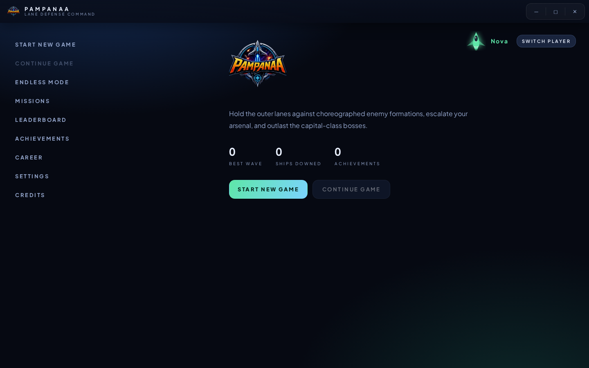

---

## Highlights

- **Seven distinct weapons** across five damage elements — kinetic, photon, explosive, fire, electric and ice.
- **Per-weapon progression.** Amplifier pickups upgrade only the weapon you were holding when you grabbed them, so every gun has its own build.
- **Status effects.** Burn, chill and full freeze stack from the Flame and Cryo lines; Tesla arcs chain between targets and slow them.
- **Named bosses.** Sixteen thinker-bosses with telegraph → attack → exposed-core phase loops, layered shields, and an enrage state below 40% hull.
- **Five campaign acts** of choreographed waves plus an endless drift mode.
- **Full front end**: skippable cinematic intro, sidebar shell, missions grid, leaderboard, achievements, career stats, deep settings and an in-game codex.
- **Local-first profiles**, save slots, and progress tracking — no account required.

---

## Screenshots

### Cinematic intro (skippable)
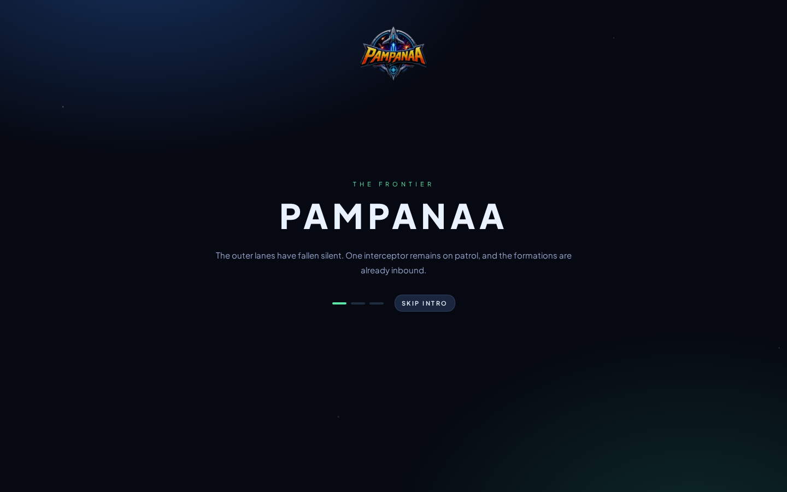

### Pilot select
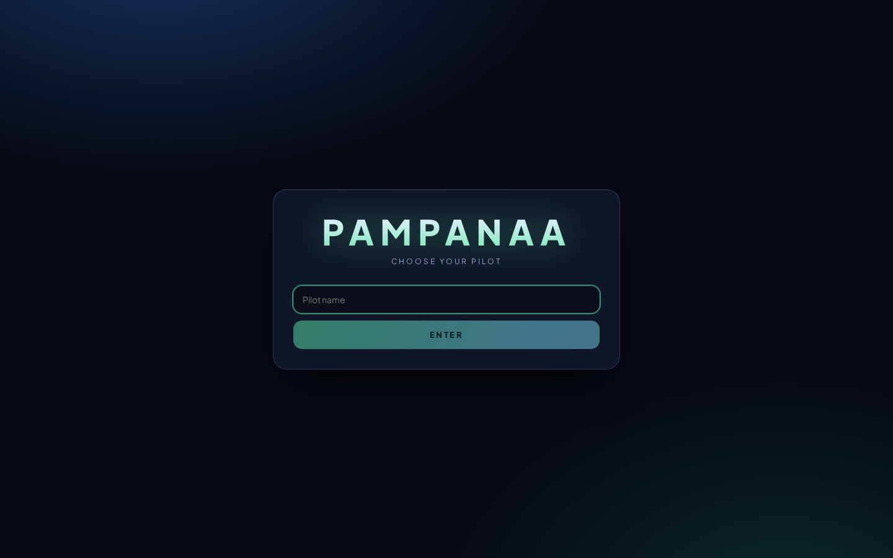

### Main menu shell


### Missions — campaign acts
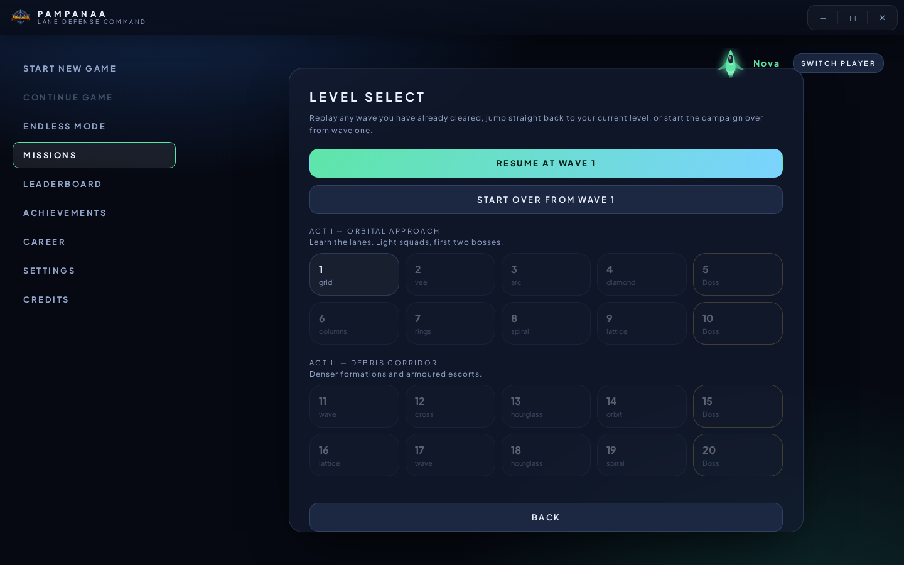

### Settings
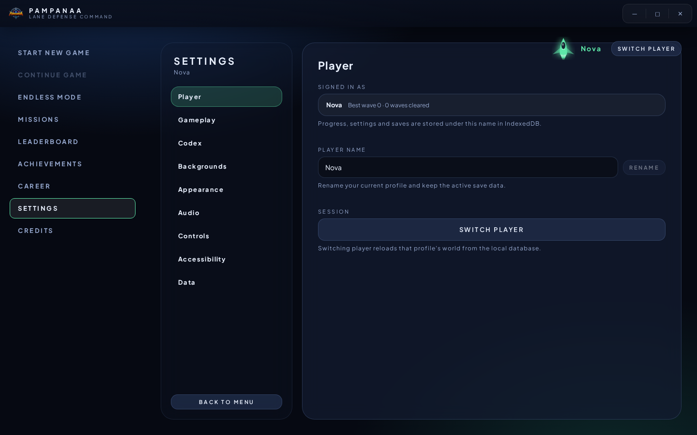

### Codex — weapons and pickups explained in-game
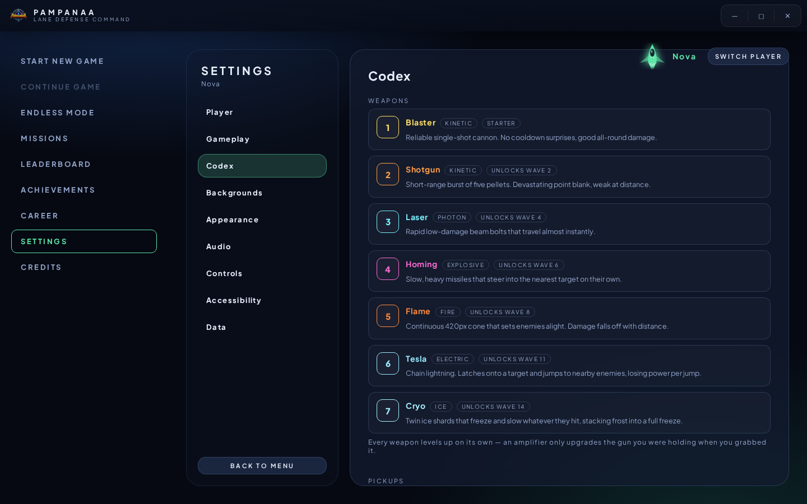

### Achievements
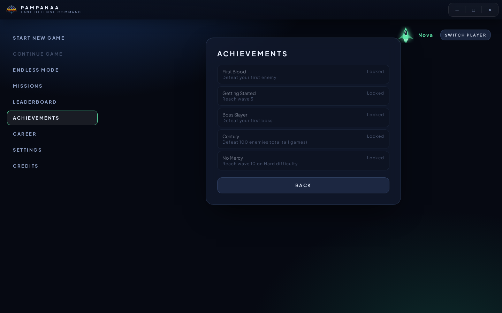

### Career stats
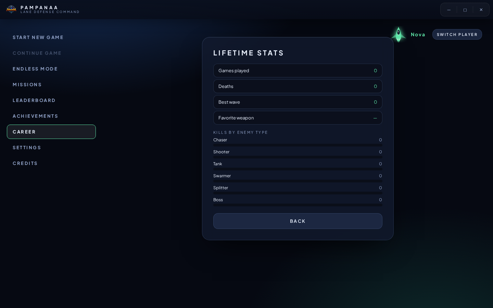

### Leaderboard
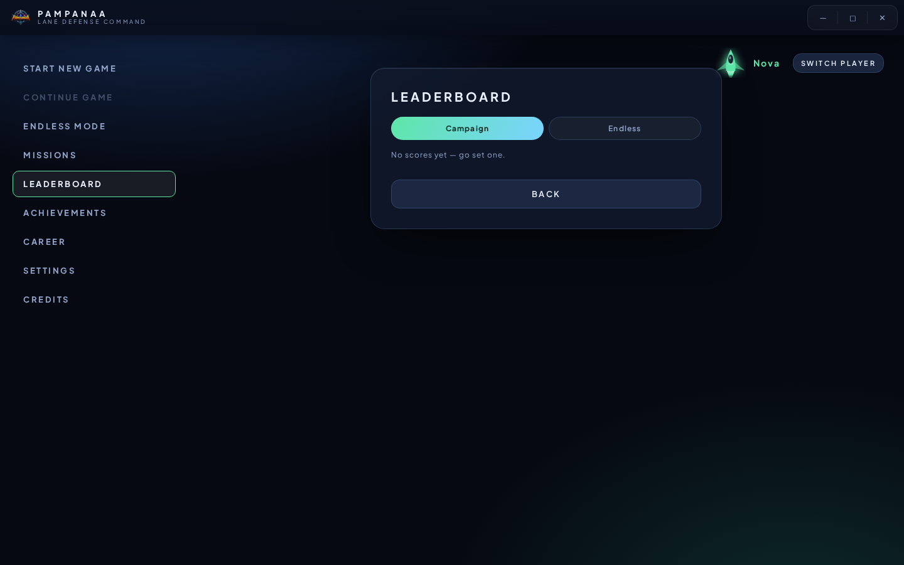

### How to play
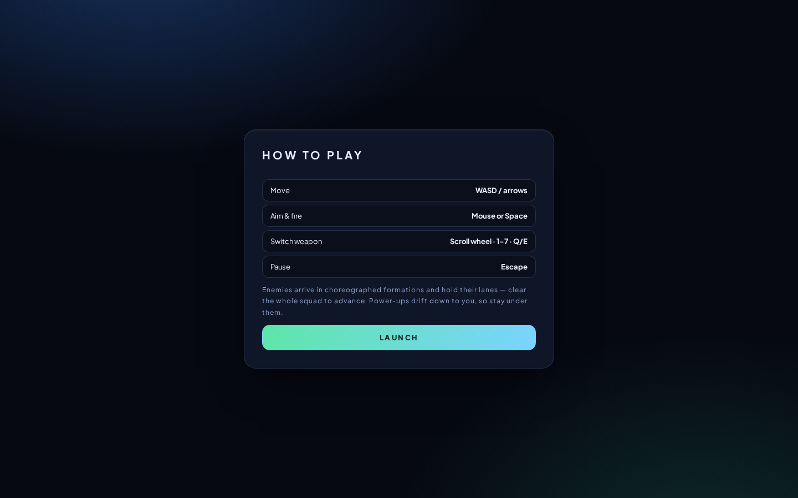

### Gameplay
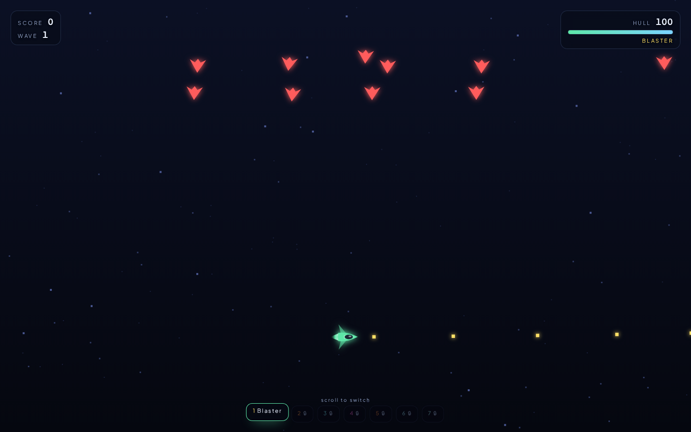

### Pause menu
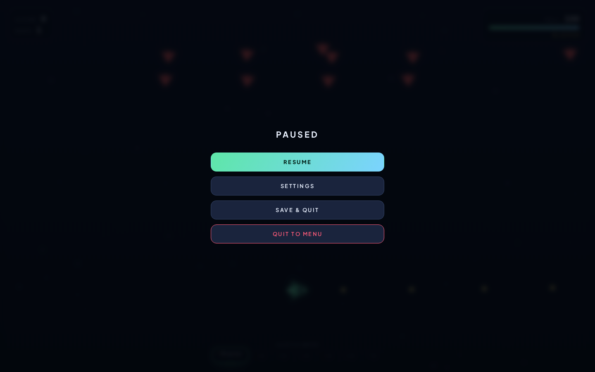

---

## Arsenal

| # | Weapon | Element | Unlocks | Behaviour |
|---|--------|---------|---------|-----------|
| 1 | Blaster | Kinetic | Start | Reliable single-shot cannon, good all-round damage. |
| 2 | Shotgun | Kinetic | Wave 2 | Five-pellet burst, devastating point blank. |
| 3 | Laser | Photon | Wave 4 | Rapid low-damage bolts that travel almost instantly. |
| 4 | Homing | Explosive | Wave 6 | Slow heavy missiles that steer into the nearest target. |
| 5 | Flame | Fire | Wave 8 | 420px continuous cone that sets enemies alight; damage falls off with distance. |
| 6 | Tesla | Electric | Wave 11 | Chain lightning that jumps between nearby enemies, losing power per jump, and slows them. |
| 7 | Cryo | Ice | Wave 14 | Twin ice shards that stack frost until the target freezes solid. |

Switch with the scroll wheel, `1`–`7`, or `Q`/`E`.

## Pickups

Consumables affect the whole ship; amplifiers are **permanent and weapon-specific**.

| Pickup | Type | Effect |
|--------|------|--------|
| Repair | Instant | Restores 25 hull. |
| Shield | 5s | Absorbs all damage. |
| Rapid Fire | 7s | Halves every weapon's cooldown. |
| Double Score | 9s | 2× score. |
| Auto-Lock | 12s | Fire tracks the nearest enemy. |
| Multi-Shot | 10s | Doubles the barrels of the held weapon. |
| Barrel Multiplier | Permanent | +1 barrel on the held weapon (max 5). Flame widens, Tesla gains a chain jump. |
| Damage Amplifier | Permanent | +20% damage; 2 stacks add burn on hit. |
| Cadence Amplifier | Permanent | +15% fire rate; 3 stacks slow on hit. |
| Piercing Rounds | Permanent | Rounds punch through enemies. |

Every pickup and weapon is also documented in-game under **Settings → Codex**.

## Campaign acts

| Act | Waves | Theme |
|-----|-------|-------|
| I — Orbital Approach | 1–10 | Learn the lanes; light squads, first two bosses. |
| II — Debris Corridor | 11–20 | Denser formations and armoured escorts. |
| III — Fracture Belt | 21–30 | Split-and-swarm patterns with shielded bosses. |
| IV — Deep Field | 31–40 | Full roster, enraged bosses. |
| V — Endless Drift | 41+ | Procedural waves that never stop scaling. |

Bosses appear every fifth wave, drawn from a sixteen-strong roster (Newton, Pythagoras, Einstein, Lovelace, Curie, Turing, Hypatia, Ramanujan, Nietzsche, Euclid, Noether, Fibonacci, Kepler, Tesla, Boltzmann, Gödel). Each is armoured except during its exposed-core window, where damage doubles.

---

## Controls

| Action | Input |
|--------|-------|
| Move | `WASD` / arrow keys |
| Aim & fire | Mouse or `Space` |
| Switch weapon | Scroll wheel · `1`–`7` · `Q`/`E` |
| Pause | `Escape` |

Gamepad and touch controls are supported; key bindings are remappable in **Settings → Controls**.

---

## Getting started

```bash
bun install      # or npm install
bun run dev      # http://localhost:8080
bun run build    # production bundle in dist/
```

### Desktop (Electron)

```bash
bun run electron        # run the desktop shell
bun run electron:build  # package installers
```

App icons live at `public/icon.ico` (Windows) and `public/icon.png` (macOS/Linux); the browser favicon is `public/favicon.png`.

---

## Tech stack

- React 18 + Vite
- Canvas 2D rendering with a custom game engine, quadtree collision, object pooling and a particle system
- Web Audio synthesis for all sound effects
- IndexedDB for profiles, saves, settings, scores and achievements
- Electron for the desktop build

## Project layout

```
src/
  canvas/       engine, renderers, sprite drawing, background themes
  components/
    enemy/      enemy defs, formations, bosses
    weapons/    weapon base class + seven weapon types
    pickups/    pickup definitions and codex data
    player/     ship, per-weapon amplifiers
    physics/    quadtree, vectors, collision
    effects/    particles, damage numbers, screen shake
    game/       HUD, canvas host, pause, weapon selector
  pages/        splash, menu shell, missions, settings, stats, credits
  database/     IndexedDB access layer
  utils/        wave/stage config, constants, achievement defs
```

## License

See `LICENSE` and `Eula.txt`.
