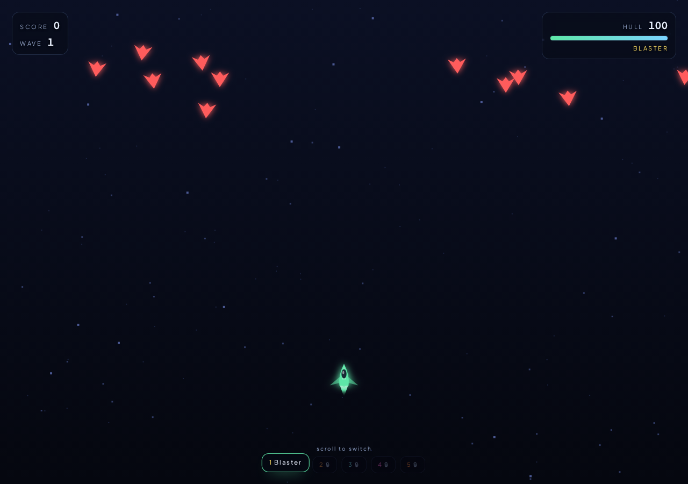
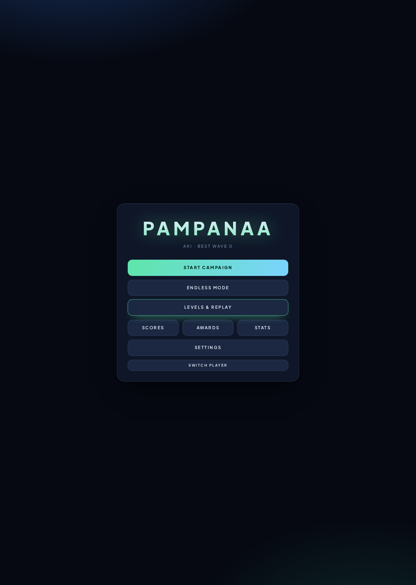
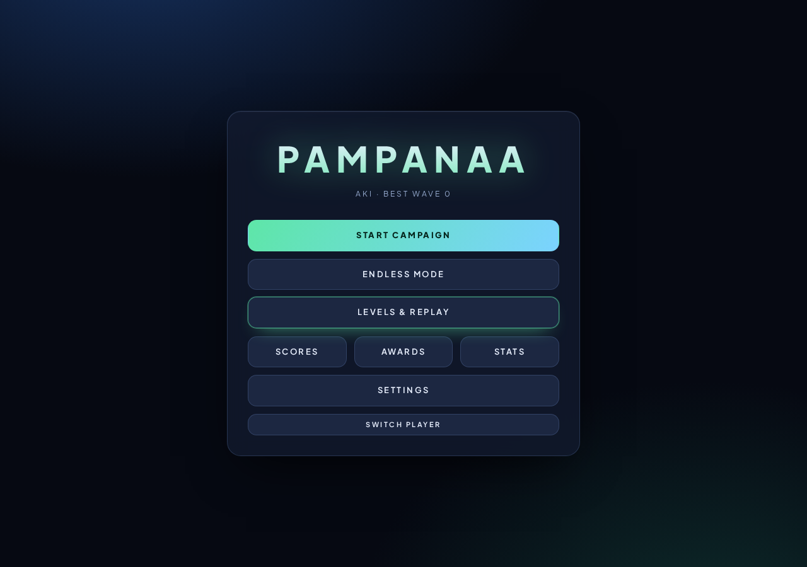
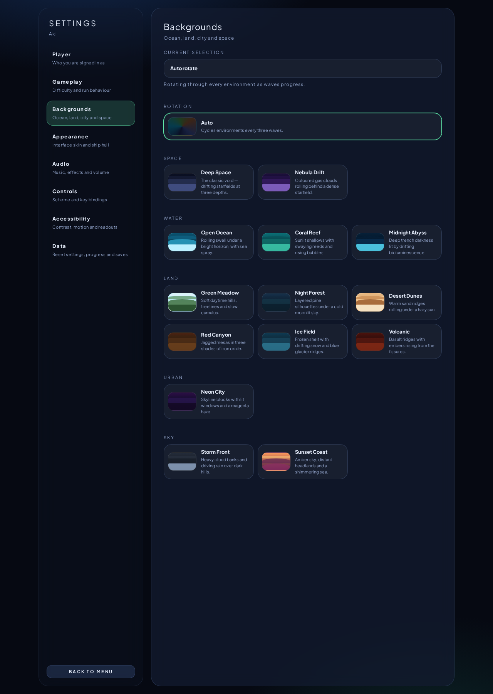
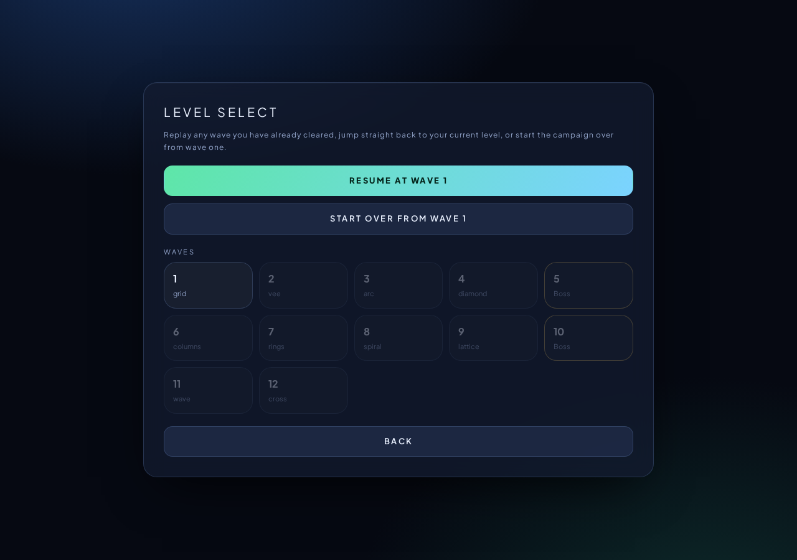

# Pampanaa

**Pampanaa** is an offline-first arcade formation shooter that runs entirely in the browser. Choreographed enemy squads sweep in across 14 procedurally drawn environments — ocean, land, city, sky and deep space — while you clear waves, unlock weapons and chase your best score. Every player has a named profile stored locally in IndexedDB, so progress, settings, saves and achievements follow the name you sign in with. No account, no server, no password.



---

## Table of contents

- [Features](#features)
- [Screenshots](#screenshots)
- [Getting started](#getting-started)
- [How to play](#how-to-play)
- [Game systems](#game-systems)
- [Settings reference](#settings-reference)
- [Data & persistence](#data--persistence)
- [Tech stack](#tech-stack)
- [Project structure](#project-structure)
- [Contributing](#contributing)
- [License](#license)

---

## Features

- **Named player profiles** — sign in with any name; progress, settings, saves, scores and achievements are namespaced per profile in IndexedDB.
- **14 background environments** — Deep Space, Nebula Drift, Open Ocean, Coral Reef, Midnight Abyss, Green Meadow, Night Forest, Desert Dunes, Red Canyon, Ice Field, Volcanic, Neon City, Storm Front and Sunset Coast — each rendered with a multi-layer procedural parallax engine (waves, dunes, hills, skylines, treelines, rain, snow, bubbles, clouds).
- **Auto rotation or a locked theme** — pick one environment or let the game cycle every three waves.
- **Level select & replay** — replay any cleared wave, resume at your current level, or start the campaign over. Per-wave best scores are tracked.
- **Twenty-one enemy species** — every enemy is a mathematical figure: polygons, star polygons, lemniscate, astroid, rose curve, cardioid, helix, torus, Sierpinski triangle, squircle, gear, heptagram, trefoil knot, epicycloid, spirograph and crescent.
- **Layered attack logic** — aimed, fan, radial, ring, spiral, cross, sweeping arc, curtain wall and lobbed shell patterns, plus zigzag, weave, jitter, orbit, figure-eight and pulse movement.
- **Formation choreography** — grid, vee, arc, diamond, columns, rings, spiral, lattice, wave, cross, hourglass and orbit formations animated with sway, pendulum, breathe, tide, carousel, drift and figure-eight routines.
- **Five weapons** — blaster, shotgun, laser, homing missiles and flamethrower, unlocked as waves progress.
- **Boss waves** every fifth wave, with dedicated multi-phase boss bodies.
- **Redesigned settings** — transparent sidebar navigation, grouped categories, plain-language descriptions and a live preview for every background.
- **Accessibility** — colourblind palette, reduced motion, screen-shake toggle, FPS readout, rebindable keys, and keyboard / mouse / touch / gamepad support.
- **Centered achievement toasts**, hidden scrollbars everywhere, and a Plus Jakarta Sans type system with soft, rounded Apple-style controls.
- **Fully offline** — no network calls at runtime.

## Screenshots

| Sign in | Main menu |
| --- | --- |
|  |  |

| Settings — backgrounds | Level select |
| --- | --- |
|  |  |

## Getting started

### Requirements

- Node.js 20+ (or [Bun](https://bun.sh) 1.1+)
- A Chromium, Firefox or Safari build with Canvas 2D and IndexedDB

### Install and run

```bash
bun install       # or: npm install
bun run dev       # or: npm run dev
```

The dev server starts on [http://localhost:8080](http://localhost:8080).

### Production build

```bash
bun run build
bun run start
```

## How to play

| Action | Input |
| --- | --- |
| Move | `W A S D` / arrow keys / left stick / touch stick |
| Aim & fire | Mouse, `Space`, right trigger, or touch fire button |
| Switch weapon | Scroll wheel, `1`–`5`, `Q` / `E` |
| Pause | `Escape` |

Enemies arrive as a choreographed squad and hold their lanes. Clear the whole squad to advance the wave. Power-ups drift downward — fly under them to collect. Every fifth wave is a boss.

## Game systems

**Waves.** Each wave defines a formation, a choreography routine, a roster of species, row/column counts and a fire-rate multiplier. Beyond the authored table, waves are generated procedurally so endless mode never runs dry.

**Difficulty.** A single 1–8 slider scales enemy health, squad size, formation speed, firing cadence and pickup frequency.

**Weapons.** Blaster (wave 1), shotgun, laser, homing missile and flamethrower unlock at set waves. Damage and fire-rate amps drop as pickups; heavily amped rounds set enemies alight and slow their cadence.

**Achievements.** Unlocks are stored per profile and surface as a centered toast; some award new ship skins.

## Settings reference

| Section | What it controls |
| --- | --- |
| Player | Active profile, lifetime summary, switch player |
| Gameplay | Difficulty slider, auto-save, damage numbers, screen shake, replay the tutorial card |
| Backgrounds | Auto rotation or any of the 14 environments, with a preview and description each |
| Appearance | Six interface themes and four ship hull designs |
| Audio | Master volume, sound effects, procedural music, music volume |
| Controls | Control scheme and rebindable movement/fire keys |
| Accessibility | Colourblind palette, reduced motion, FPS counter |
| Data | Reset settings, clear the saved run, erase progress |

Every control on the page is wired to persistent state — changes apply immediately and survive a reload.

## Data & persistence

All data lives in the browser's IndexedDB database (`pampanaa`, schema v4) with these stores:

| Store | Contents |
| --- | --- |
| `profiles` | Player names, creation time, last session |
| `settings` | Per-profile settings record |
| `playerProgress` | Unlocks, cleared waves, per-wave best scores, lifetime stats |
| `saves` | Resume snapshots written on wave clear when auto-save is on |
| `scores` | Local leaderboard entries |
| `achievements` | Unlocked achievement ids per profile |

Nothing leaves the device. Clearing browser storage erases all profiles.

## Tech stack

- **React 19** with **TanStack Start / Router v1**
- **Vite 7** build pipeline
- **Canvas 2D** rendering — no sprites, all vector art generated at runtime
- **Web Audio API** for procedural music and effects
- **idb** for IndexedDB access
- Plain CSS with a token-driven theme layer (`src/styles/variables.css`)

## Project structure

```text
src/
  canvas/          GameEngine, parallax renderer, background themes, sprite drawer
  components/
    audio/         Procedural sound manager
    effects/       Particles, screen shake, damage numbers
    enemy/         Enemy class, species definitions, formation manager, bosses
    game/          Canvas host, HUD, pause, game over, toasts, touch controls
    physics/       Collision resolution
    pickups/       Pickup system and types
    player/        Player ship
    weapons/       Weapon definitions and projectiles
  contexts/        Game and audio providers
  database/        IndexedDB: profiles, settings, progress, saves, scores, achievements
  hooks/           Game loop, keyboard, gamepad, touch
  pages/           Profile, MainMenu, LevelSelect, GamePage, Settings, Stats, ...
  routes/          TanStack Start routes and document head metadata
  styles/          Design tokens and global stylesheet
  utils/           Constants, wave tables, achievement definitions, object pool
docs/screenshots/  README imagery
```

## Contributing

Issues and pull requests are welcome.

1. Fork the repository and create a branch.
2. Keep changes focused; match the existing code style (no build-time linting surprises).
3. Adding an enemy is a one-row change in `src/components/enemy/enemyDefs.js` plus a shape in `src/canvas/spriteDrawer.js`.
4. Adding a background is a one-entry change in `src/canvas/backgroundThemes.js`; the settings picker and rotation pick it up automatically.
5. Run `bun run build` before opening the PR.

## License

Released under the [MIT License](LICENSE).
